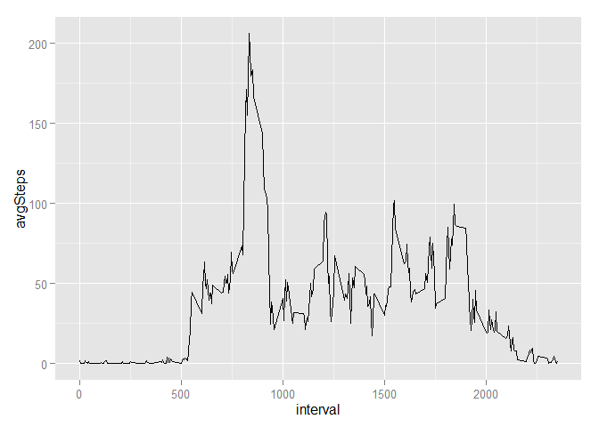
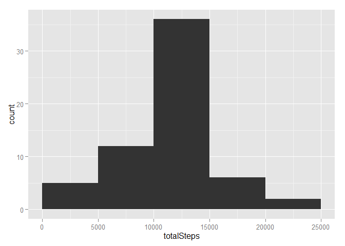

##Introduction

It is now possible to collect a large amount of data about personal movement using activity monitoring devices such as a Fitbit, Nike Fuelband, or Jawbone Up. These type of devices are part of the "quantified self" movement - a group of enthusiasts who take measurements about themselves regularly to improve their health, to find patterns in their behavior, or because they are tech geeks. But these data remain under-utilized both because the raw data are hard to obtain and there is a lack of statistical methods and software for processing and interpreting the data.

This assignment makes use of data from a personal activity monitoring device. This device collects data at 5 minute intervals through out the day. The data consists of two months of data from an anonymous individual collected during the months of October and November, 2012 and include the number of steps taken in 5 minute intervals each day.

##Data

The data for this assignment can be downloaded from the course web site:
* Dataset: Activity monitoring data [52K]

The variables included in this dataset are:
* steps: Number of steps taking in a 5-minute interval (missing values are coded as NA)
* date: The date on which the measurement was taken in YYYY-MM-DD format
* interval: Identifier for the 5-minute interval in which measurement was taken

The dataset is stored in a comma-separated-value (CSV) file and there are a total of 17,568 observations in this dataset.

##Assignment

###Loading required packages
First, lets load the required packages. We will use dplyr for data manipulation, and lattice and ggplot for plotting graphics.

```r
library(dplyr)
library(ggplot2)
library(lattice)
```

###Download an unzip the file
The following code download and unzip the file. We will not run this now and assume that we already have the file in our local drive.

```r
fileUrl <- "https://d396qusza40orc.cloudfront.net/repdata%2Fdata%2Factivity.zip"
destFile <- "dataset.zip"
download.file(fileUrl, destfile=destFile)
dateDownloaded <- date()
unzip(destFile)
```


###Loading and preprocessing the data

We will now load the data. Since the data is already in tidy format, all we have to do is change the type of date variable to Date.

```r
activity <- read.csv("activity.csv")
str(activity)
```

```
## 'data.frame':	17568 obs. of  3 variables:
##  $ steps   : int  NA NA NA NA NA NA NA NA NA NA ...
##  $ date    : Factor w/ 61 levels "2012-10-01","2012-10-02",..: 1 1 1 1 1 1 1 1 1 1 ...
##  $ interval: int  0 5 10 15 20 25 30 35 40 45 ...
```

```r
activity$date <- as.Date(activity$date)
head(activity, 3)
```

```
##   steps       date interval
## 1    NA 2012-10-01        0
## 2    NA 2012-10-01        5
## 3    NA 2012-10-01       10
```

###What is mean total number of steps taken per day?

For this part of the assignment, the missing values in the dataset is ignored.

To calculate the total number of steps taken per day, we group the data by date and sum the steps.

```r
byDate <- activity %>% group_by(date) %>% summarise(totalSteps = sum(steps))
head(byDate, 3)
```

```
## Source: local data frame [3 x 2]
## 
##         date totalSteps
## 1 2012-10-01         NA
## 2 2012-10-02        126
## 3 2012-10-03      11352
```

We can create a histogram of the total number of steps taken each day

We can use the base's hist function or the ggplot2's qplot function.

```r
hist(byDate$totalSteps)
qplot(totalSteps, data = byDate,geom = "histogram", binwidth = 5000)
```

But we will use the ggplot function from ggplot2 package instead.

```r
ggplot(data = byDate, aes(totalSteps)) + geom_histogram(breaks = seq(0, 25000, by=5000))
```

 

We can then calculate and report the mean and median total number of steps taken per day.

```r
mean(byDate$totalSteps, na.rm = TRUE)
```

```
## [1] 10766.19
```

```r
median(byDate$totalSteps, na.rm = TRUE)
```

```
## [1] 10765
```

As you can see the mean and median differ only slightly.

###What is the average daily activity pattern?

To calculate the average number of steps by interval across all the days, we group by interval and average the steps.

```r
byInterval <- activity %>% group_by(interval) %>% summarise(avgSteps = mean(steps, na.rm = TRUE))
head(byInterval,3)
```

```
## Source: local data frame [3 x 2]
## 
##   interval  avgSteps
## 1        0 1.7169811
## 2        5 0.3396226
## 3       10 0.1320755
```

We can make a time series plot (i.e. type = "l") of the 5-minute interval (x-axis) and the average number of steps taken, averaged across all days (y-axis)

We can use the base's hist function or the ggplot2's qplot function.

```r
plot(byInterval$interval, byInterval$avgSteps, type="l", xlab ="interval",ylab = "average number of steps across all days")
qplot(interval, avgSteps, data = byInterval, geom = "line")
```

But we will use the ggplot function from ggplot2 package instead.

```r
ggplot(data = byInterval, aes(interval, avgSteps)) + geom_line()
```

 

We can check which 5-minute interval, on average across all the days in the dataset, contains the maximum number of steps

```r
byInterval[which.max(byInterval$avgSteps),]
```

```
## Source: local data frame [1 x 2]
## 
##   interval avgSteps
## 1      835 206.1698
```

###Imputing missing values

Note that there are a number of days/intervals where there are missing values (coded as NA). The presence of missing days may introduce bias into some calculations or summaries of the data.

Let's calculate and report the total number of missing values in the dataset (i.e. the total number of rows with NAs).

```r
length(activity$steps[is.na(activity$steps)])
```

```
## [1] 2304
```

Since we already have the average steps by interval for each day, we will impute NA values using that to the dataset. 

```r
activityImputed <- left_join(activity,byInterval,by=c("interval" = "interval"))
activityImputed$steps[is.na(activityImputed$steps)] <- activityImputed$avgSteps[is.na(activityImputed$steps)]
head(activityImputed, 3)
```

```
##       steps       date interval  avgSteps
## 1 1.7169811 2012-10-01        0 1.7169811
## 2 0.3396226 2012-10-01        5 0.3396226
## 3 0.1320755 2012-10-01       10 0.1320755
```

We can create a new dataset that is equal to the original dataset but with the missing data filled in.

```r
activityImputed$avgSteps = NULL
```

To calculate the total number of steps taken per day, we group by date and sum the steps.

```r
byDateImputed <- activityImputed %>% group_by(date) %>% summarise(totalSteps = sum(steps))
head(byDateImputed, 3)
```

```
## Source: local data frame [3 x 2]
## 
##         date totalSteps
## 1 2012-10-01   10766.19
## 2 2012-10-02     126.00
## 3 2012-10-03   11352.00
```

We can make a histogram of the total number of steps taken each day

We can use the base's hist function or the ggplot2's qplot function.

```r
hist(byDateImputed$totalSteps)
qplot(totalSteps, data = byDateImputed,geom = "histogram", binwidth = 5000)
```

But we will use the ggplot function from ggplot2 package instead.

```r
ggplot(data = byDateImputed, aes(totalSteps)) + geom_histogram(breaks = seq(0, 25000, by=5000))
```

 

Let's calculate and report the mean and median total number of steps taken per day

```r
mean(byDateImputed$totalSteps, na.rm = TRUE)
```

```
## [1] 10766.19
```

```r
median(byDateImputed$totalSteps, na.rm = TRUE)
```

```
## [1] 10766.19
```

The mean value is the same with the mean from the first assignment while the median value sligthly differs from the first assignment. The mean is the same since we impute using the mean of for that day.

The impact of imputing missing data is non-significant for the mean and median, however it does increase the total daily number of steps, since we introduce values to the missing observations.

###Are there differences in activity patterns between weekdays and weekends?

Let's create a new factor variable in the dataset with two levels - "weekday" and "weekend" indicating whether a given date is a weekday or weekend day

```r
activityImputed$daytipe <- as.factor(ifelse(weekdays(activityImputed$date) %in% c("Saturday","Sunday"),"weekend","weekday"))
byIntervalImputed <- activityImputed %>% group_by(interval, daytipe) %>% summarise(avgSteps = mean(steps, na.rm = TRUE))
head(byIntervalImputed, 3)
```

```
## Source: local data frame [3 x 3]
## Groups: interval
## 
##   interval daytipe  avgSteps
## 1        0 weekday 2.2511530
## 2        0 weekend 0.2146226
## 3        5 weekday 0.4452830
```

We can then make a panel plot containing a time series plot (i.e. type = "l") of the 5-minute interval (x-axis) and the average number of steps taken, averaged across all weekday days or weekend days (y-axis). We will use xyplot function from lattice package for this.

```r
xyplot(avgSteps ~ interval | daytipe, type="l", data = byIntervalImputed, layout = c(1,2))
```

 

We can see that in the weekends the person tend to get up later compare to in weekdays. In addition, there are more activities (steps) during the day in weekends compare to in weekdays.


